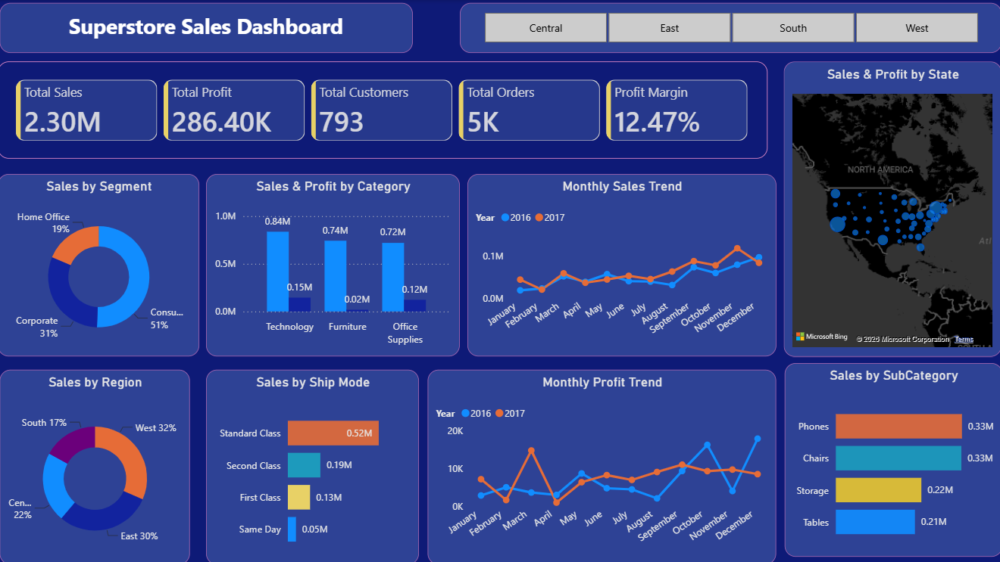

# 🛒 Business Insights with Superstore Sales Analytics

Welcome to a project where **business meets data**. This repository is an end-to-end analytics solution designed to analyze sales, profit, customers, products, and regional performance — answering important business questions:

> 💭 Which categories and products generate the most sales?

> 💭 Which products and regions are most profitable?

> 💭 How do discounts impact overall profitability?

---

## 🧠 Project in a Nutshell

This project brings together **Python, SQL, and Power BI** to transform raw Superstore sales data into meaningful business intelligence.

Using data cleaning, exploratory data analysis, SQL queries, and interactive dashboards, the project uncovers patterns in **sales performance, profitability, customer behavior, product performance, and regional trends**.

🎯 **Final Outcome:** A complete analytics solution with KPIs, visualizations, business insights, and an interactive Power BI dashboard.

---

## 🧩 Key Components

| Module                | Description                                            |
| --------------------- | ------------------------------------------------------ |
| 🛠 Python             | Clean, preprocess, and analyze Superstore sales data   |
| 📊 EDA in Python      | Explore sales, profit, customers, products, and trends |
| 🧾 SQL Analysis       | Perform business analysis using MySQL queries          |
| 📈 Data Visualization | Create charts using Matplotlib and Seaborn             |
| 📊 Power BI Dashboard | Build an interactive dashboard with KPIs and filters   |

---

## 📊 Sneak Peek into Business Insights

✔ Analyzed overall **sales and profit performance** across different business dimensions

✔ Identified **top-performing categories, sub-categories, products, and customers**

✔ Analyzed **regional and state-level sales and profitability**

✔ Studied **monthly and yearly sales trends**

✔ Identified cases where **high sales do not necessarily result in high profit**

✔ Analyzed the relationship between **discounts and profitability**

---

## 🖥 Power BI Dashboard Preview

Built with business users in mind — making it easy to explore sales performance, profitability, customers, products, and regions through interactive filters.

---

## 🚀 What Makes This Project Unique?

* ✅ **End-to-end workflow:** From raw CSV data to interactive Power BI dashboard
* ✅ **Multi-tool analytics:** Python, SQL, and Power BI combined in one project
* ✅ **Business-focused analysis:** Focuses on actionable sales and profitability insights
* ✅ **Interactive storytelling:** Converts complex data into easy-to-understand visual insights

---

## 👨‍💻 Built By

**Nilesh Pardhi**

🎓 B.Tech — Artificial Intelligence & Machine Learning
🧠 Python • SQL • MySQL • Power BI • Data Analysis • Data Visualization

🔗 GitHub | LinkedIn

---

## 📌 Ideal For

* 📥 Recruiters evaluating data analysis and problem-solving skills
* 🎓 Students learning end-to-end data analytics
* 📊 Beginners building Python, SQL, and Power BI portfolios
* 💼 Analysts looking for a practical business analytics project

> **This isn't just a dashboard. It's a complete data analytics workflow designed to turn raw sales data into meaningful business insights.**

---

## 🏁 Final Thoughts

This project demonstrates how raw business data can be transformed into **clean information, meaningful analysis, interactive visualizations, and actionable insights**.

It represents a practical approach to solving real-world business problems using **Python, SQL, and Power BI**.

🚀 **Turning raw data into business insights, one analysis at a time.**
